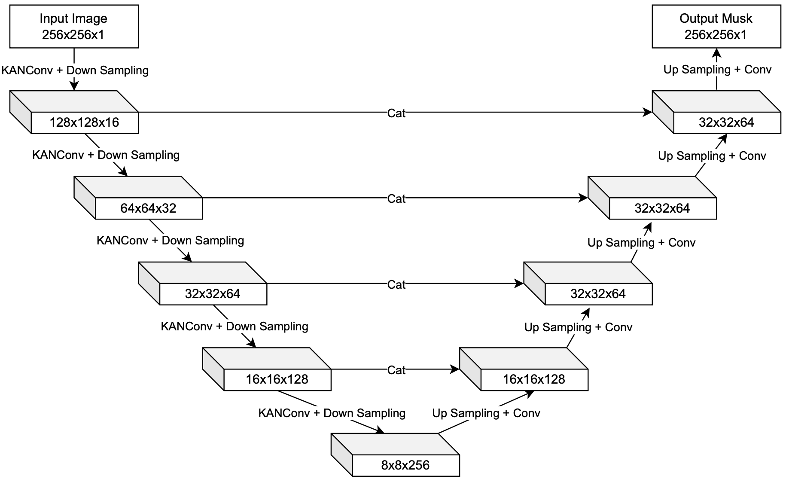
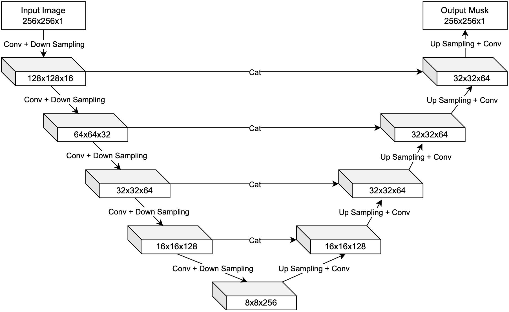

# EIE4512-U-Net-with-KAN
 
This is a course final report for 24 summer EIE4512 in CUHKSZ. 

---

## Abstract

Kolmogorov-Arnold Networks (KANs) have outperformed Multi-Layer Perceptrons (MLPs) in multiple tasks. However, a considerable gap exists between current methods and combining KANs into convolutional neural networks in medical image segmentation due to insufficient exploration of KANs. In this paper, we propose U-ConvKan, a unique method of combining KANs with CNNs in medical image segmentation. This is achieved by replacing classical convolutional layers with KAN convolutional layers in the encoder part of U-Net architecture. Particularly, U-ConvKan improves the training speed by using models with smaller sizes and shows interesting results in interpretability. 

---

## Introduction

Multi-layer perceptrons (MLPs) are fundamental building blocks of today's deep learning models. They have shown tremendous results in the past ten years. However, drawbacks such as lack of interpretability, catastrophic forgetting, and time-consuming are still to be solved. Under this circumstance, inspired by the Kolmogorov-Arnold representation theorem, Kolmogorov-Arnold Networks (KANs)  were released. KANs have outperformed MLPs in several tasks and are becoming a promising alternative to MLPs.

But contrary to the solid theoretical analysis, KANs are still short of experiments to determine their ability compared to MLPs. Moreover, there is a significant gap in combining KANs with MLPs. Previous research used different methods to integrate KANs into convolutional neural networks \cite{li2024u,UNet-KANConv}, but either their integration is not sufficient or their results are below expectation.

To address these challenges, in this paper, we propose U-ConvKan, a model combining U-Net architecture with KANs for medical image segmentation. We replace the classical convolutional layers in the encoder part of U-Net architecture with KAN convolutional layers while maintaining the decoder part. By doing so we can obtain advantages from both architectures and achieve better results. We train our model on a small medical image segmentation set for brain tumors. After experiments, we find out that our model maintains the performance of U-Net models while significantly reducing training time and model size. We also seek connections between deep learning methods and traditional image process methods by visualization and explain different learning techniques used by U-ConvKan.

Our main contribution can be summarized as follows:

- We introduce U-ConvKan, a model derived from U-Net architecture using both classical convolution and KAN convolution for image semantic segmentation. 
- We show that our model outperforms classical convolutional neural networks in several metrics. Moreover, We visualize relations between deep learning methods and traditional image processing methods in image segmentation. At last, we use mathematical analysis to verify the differences between KAN convolution and classical convolution.

---

## The Proposed Algorithm

In this section, we propose the implementation detail of **UDKCONV**, which consists of two main modules: KAN Convolutional Encoder and Classical Convolutional Decoder. We use skip-connection to retrieve image details from the encoder to the decoder. Next, we will explain the details of each module.

### KAN Convolutional Encoder

KAN Convolutional Encoder is a contracting path consisting of 5 layers. Due to limited computational resources, we expanded the channels to a rather small figure. The first layer expands the channels 16 times while other layers increase 2 times larger. Every convolutional step uses 3x3 KAN kernels with padding. Moreover, we use a downsampling technique derived from U-Net architecture for the first four layers until reaches the bottleneck. Each downsampling process uses a 2x2 max-pooling operation with stride 2.

We reach a feature map with 256 channels at the bottleneck.

### Classical Convolution Decoder

The classical convolutional decoder is an expansive path using a smaller version of the U-Net decoder. Each of its first four layers consists of a 2x2 up-sampling process, two 3x3 convolutions, and a Relu activation function which halves the number of channels in the feature map. Skip connection is used by concatenating the correspondingly cropped feature map from the encoder after each up-sampling step. The concatenation can reserve more image details due to the loss of border pixels from convolution. Finally, a 1x1 convolution is used to map each 16-component feature map to the output, which is a one-channel 2D vector representing pixels being brain tumor or not.

## Experiments 

### Setup 

#### Dataset 
- **Name**: TumorSegmentation
- **Export Date**: August 19, 2023
- **Number of Images**: 2,146 MRI images
- **Annotation Format**: COCO Segmentation
- **Preprocessing**: - Auto-orientation of pixel data (EXIF-orientation stripping)
  - Resizing to 640 × 640 pixels (stretch)
  - No image augmentation
- **Examples**: 

#### Baseline 
- **Model**: Simplified U-Net
- **Architecture**:
  - Input Layer: 256x256x1
  - Hidden Layers: 128x128x16, 64x64x32, 32x32x64, 16x16x128, 8x8x256
  - Bottleneck Layer: 16x16x128
  - Up-Sampling Layers: 32x32x64, 64x64x32, 128x128x16, 256x256x1
- **Architecture Diagram**: 

#### Implementation 
- **Data Normalization**: Applied to standardize input data.
- **Training Epochs**: 10 epochs for both models.
- **Loss Function**: Cross-entropy loss.
- **Hardware**: Nvidia A100 GPU with 80 GB of memory.
- **Source Code**: [EIE4512-U-Net-with-KAN](https://github.com/EIE4512-U-Net-with-KAN)

#### Metric 
- **Evaluation Metrics**:
  - Training and testing loss values
  - Training time
  - Model size
  - Visual performance

### Result 

- **Improvements**:
  - Reduced training time
  - Smaller model size: 4.56 MB v.s. 9.04 MB
  - Comparable performance to the baseline

---

## Instructions

When you are reproducing the code, you need to place the dataset files in the corresponding locations and run the dataset preprocessing program as required.